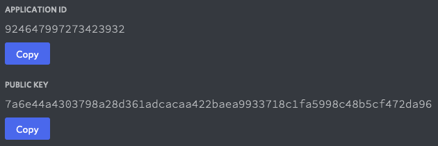
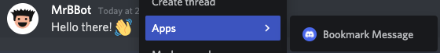

# ⚔️ Slshx

**Slshx** is a slightly wacky, experimental, library for building strongly-typed
[Discord commands](https://discord.com/developers/docs/interactions/application-commands)
that run on [Cloudflare Workers](https://workers.cloudflare.com/), using a
React-inspired syntax. It focuses on providing a great local development
experience, powered by [🔥 Miniflare](https://miniflare.dev/).

<!-- prettier-ignore-start -->
```tsx
import { CommandHandler, Message, createElement, createHandler, useDescription, useNumber } from "slshx";

function add(): CommandHandler {
  useDescription("Adds two numbers together");
  const a = useNumber("a", "1st number", { required: true });
  const b = useNumber("b", "2nd number", { required: true });
  return (interaction, env, ctx) => (
    <Message ephemeral>{a} + {b} = {a + b}</Message>
  );
};

const handler = createHandler({
  applicationId: "...",
  applicationPublicKey: "...",
  commands: { add },
});

export default { fetch: handler };
```
<!-- prettier-ignore-end -->

## Features

- ⚔️ Chat Input (Slash) Commands
- 🙂 User Commands
- ✉️ Message Commands
- 💪 Strongly-Typed Command Options and API Bindings
- 🔥 Auto-Deploy Commands on Change (think live reload, but for commands)
- 👇 Interactive Message Components (Buttons, Select Menus)
- ⚛️ React-Inspired Syntax
- 😇 Autocomplete for Command Options
- 🌲 Highly Tree-Shakeable
- ✨ No Runtime Dependencies

## Quick*ish* Start

1. Clone the [`slshx-starter`](https://github.com/mrbbot/slshx-starter)
   repository. This includes a [Miniflare](https://miniflare.dev/) and
   [`esbuild`](https://esbuild.github.io/) setup that removes unneeded local
   development code when deploying to Workers.

   > ⚠️ To enable auto-deployments on reload, Slshx requires the
   > [`--global-async-io` Miniflare flag](https://miniflare.dev/core/standards#global-functionality-limits)
   > to be set. `slshx-starter` automatically enables this for you.

2. Copy the `env.example.jsonc` file to `env.jsonc`. ⚠️ Do not commit this file.
3. Create a new application in the
   [Discord Developer Portal](https://discord.com/developers/applications). Copy
   the **Application ID** and **Public Key** into the `development` section of
   `env.jsonc`.<br>
   
   > You will probably want to create 2 applications: one for development, and
   > one for production, using your deployed worker's URL.
4. Click on **OAuth2** in the sidebar, and copy your application's **Client
   Secret** into the `development` section of `env.jsonc`. ⚠️ Do not share this
   secret with anyone! Keep this tab open, we'll need to add some more stuff
   later.<br> 
5. Run `npm install` in your cloned repository, then `npm run dev` to start the
   local development server.
6. Setup
   [Cloudflare Tunnel](https://developers.cloudflare.com/cloudflare-one/tutorials/single-command)
   so Discord can reach your local development server when invoking your
   commands. Follow
   [these instructions](https://developers.cloudflare.com/cloudflare-one/tutorials/single-command),
   then when you're ready to start the tunnel, run:<br>
   `cloudflared tunnel --hostname <hostname> --url localhost:8787 --name slshx`
7. Make sure your tunnel is working by visiting `https://<hostname>/` in your
   browser. This should show the ⚔️ **Slshx** landing page. Click the **Add to
   Server** button to connect your application with one of your servers. You may
   want to create a new one just for testing your commands.<br>
   
8. Copy the **ID** of the server you just added your application to into
   `testServerId` in `env.jsonc`. You can find this by enabling **Developer
   Mode** in **Discord's Advanced App Settings**, then right-clicking on the
   server in the sidebar, and clicking **Copy ID** at the bottom of the menu.
   Changes made to commands will appear instantly in this server during
   development. 🔥<br>
   <br>
   
9. Copy your Cloudflare Tunnel URL into the **Interactions Endpoint URL** field
   under your application's **General Information** in the Discord Developer
   Portal, and then click **Save Changes**. You should see some requests from
   Discord validating your endpoint in the local server logs.<br>
   
10. That's it! 🎉 You should now be able to try out the default `add` command in
    your server. Try changing the message in `src/add.tsx`. Miniflare will
    automatically reload your worker, and future command invocations will show
    the new message.<br>
    <br>
    

## Using in Existing Workers

The core of Slshx is the `createHandler` function. It takes an options object
and returns a function matching the signature of Cloudflare Workers
[module `fetch` handlers](https://developers.cloudflare.com/workers/runtime-apis/fetch-event#syntax-module-worker).
If the worker is running in Miniflare, and `applicationId`, `applicationSecret`
and `testServerId` are specified, your commands are automatically deployed to
the test server. The returned `handler` will treat every incoming `POST`
`request` as a
[Discord interaction](https://discord.com/developers/docs/interactions/receiving-and-responding),
unless you're running in Miniflare and send a `GET` request, in which case the
landing page will be returned instead.

```tsx
import { authorizeResponse, createHandler } from "slshx";

const applicationId = "...";
const handler = createHandler({
  applicationId,
  applicationPublicKey: "...",
  applicationSecret: "...", // optional
  testServerId: "...", // optional
  commands: {},
});

export default {
  async fetch(request, env, ctx) {
    const { pathname } = new URL(request.url);
    // Update your Interactions Endpoint URL to "https://<hostname>/interaction".
    if (pathname === "/interaction") {
      return handler(request, env, ctx);
    } else if (pathname === "/authorize") {
      return authorizeResponse(applicationId);
    } else {
      // ...other handlers
    }
  },
};
```

## Defining Slash Commands

All commands in Slshx are defined as synchronous functions that take no
parameters and return another handler function that might be called once. They
must always call `useDescription`, and any other `use*` functions (referred to
as hooks) before returning the handler. You **must not** use the return values
of hooks outside a returned handler. Hooks must always be called in the same
order, and must not be called conditionally.

Once you've defined your command, include it in your application by adding it to
the `commands` option passed to `createHandler`. The key used in this object
will be the name of the command (what the user types), and must not contain `:`,
`/`, `$`, or `#` characters.

When deploying commands, Slshx will run your command function _up to_ the first
`return`, recording which hooks are called.

When handling interactions, Slshx will run your command function with the
options provided by the user, returning these from hooks. The returned function
will then be called with `interaction, env, ctx`, at which point you are free to
use hook returns and should respond to the interaction.
[`interaction` is the full incoming interaction](https://discord.com/developers/docs/interactions/receiving-and-responding),
including the invoking `user`, server (`guild_id`) and continuation `token`.
`env` and `ctx` are the same
[parameters passed to the worker `handler`](https://developers.cloudflare.com/workers/runtime-apis/fetch-event#syntax-module-worker).

<!-- prettier-ignore-start -->
```tsx
import { CommandHandler, createElement, createHandler, useDescription, useNumber } from "slshx";
import type { APIChatInputApplicationCommandInteraction } from "discord-api-types/v10";

type Env = { KV_NAMESPACE: KVNamespace; SECRET: string };

function add(): CommandHandler {
  // ✅: must call `useDescription`
  // ✅: must call hooks before returning handler
  // ✅: must call hooks in the same order each time
  useDescription("Adds two numbers together");
  const a = useNumber("a", "1st number", { required: true });
  const b = useNumber("b", "2nd number", { required: true });

  // ❌: must not use hook return values outside handler
  if (a > 5) {
    // ❌: must not call hooks conditionally
    const c = useNumber("c", "3rd number", { required: true });
  }

  // Return a handler function, this will get called at most once
  return (interaction, env, ctx) => {
    //    │            │    └ ExecutionContext
    //    │            └ Env
    //    └ APIChatInputApplicationCommandInteraction
    //
    // ✅: safe to use hook return values inside handler
    return <Message>{a} + {b} = {a + b}</Message>;
  };
}

const handler = createHandler({
  // ...
  commands: { add },
});

export default { fetch: handler };
```
<!-- prettier-ignore-end -->

### Options

Slshx includes hooks for
[all available option types](https://discord.com/developers/docs/interactions/application-commands#application-command-object-application-command-option-type).
If a user doesn't provide a value for an option, the hook will return `null`.

All options take a `name` and `description`. They can be marked as `required`,
in which case Discord will enforce that a value is provided before submitting
the interaction. The return type of the hook excludes `null` in this case.

Some types have additional optional fields that control acceptable values.

<!-- prettier-ignore-start -->
```tsx
import { ChannelType } from "slshx";
import type { APIUser, APIInteractionDataResolvedChannel, APIRole, APIAttachment } from "discord-api-types/v10";

function cmd(): CommandHandler {
  useDescription("Command demonstrating option types");
  
  const s1 = useString("name", "Description");
  //    └ string | null
  const s2 = useString("name", "Description", { required: true });
  //    └ string

  const i1 = useInteger("name", "Description");
  //    └ number | null
  const i2 = useInteger("name", "Description", { min: 5, max: 100 });

  const b = useBoolean("name", "Description");
  //    └ boolean | null

  const u = useUser("name", "Description");
  //    └ APIUser | null

  const c1 = useChannel("name", "Description");
  //    └ APIInteractionDataResolvedChannel | null
  const c2 = useChannel("name", "Description", {
    // https://discord.com/developers/docs/resources/channel#channel-object-channel-types
    types: [ChannelType.GUILD_TEXT, ChannelType.DM],
  });

  const r = useRole("name", "Description");
  //    └ APIRole | null

  const m = useMentionable("name", "Description");
  //    └ APIUser | APIRole | null

  const n1 = useNumber("name", "Description");
  //    └ number | null
  const n2 = useNumber("name", "Description", { min: 5, max: 100 });
  
  const a = useAttachment("name", "Description");
  //    └ APIAttachment | null

  return () => {}; // ...
};
```
<!-- prettier-ignore-end -->

### Choices

String, integer, and number options can be configured with up to 25 choices to
pick from. Like `required`, Discord will enforce that the value provided is one
of these before submitting the interaction. You can optionally provide a `name`
for the choice. This will be displayed instead, but the `value` will still be
returned to you.

```tsx
function cmd(): CommandHandler {
  useDescription("Command demonstrating choices");

  //    ┌ "foo" | "bar" | "baz"
  const s = useString("str", "Description", {
    choices: ["foo", { value: "bar" }, { name: "Baz", value: "baz" }] as const,
    // The `as const` is important here. Without it, the inferred type of `s`
    // would just be `string`, instead of `"foo" | "bar" | "baz"`.
    required: true, // Mark as `required` to exclude `null` from inferred type
  });

  //    ┌ 1 | 2 | 3 | null
  const n = useNumber("num", "Description", {
    choices: [1, { value: 2 }, { name: "Three", value: 3 }] as const,
  });

  return () => {}; // ...
}
```


### Autocomplete

If you've got more than 25 choices, or don't know them ahead of time, you can
use
[Discord's autocomplete feature](https://discord.com/developers/docs/interactions/application-commands#autocomplete).
This is a separate interaction Discord will submit to your application whenever
the user starts typing something for an option. Hooks return the correct values
on autocomplete interactions, so you're free to use those results when building
suggestions. Similarly to choices, you can optionally provide a `name` for the
suggestion, which will be displayed instead.

```tsx
import type { APIApplicationCommandAutocompleteInteraction } from "discord-api-types/payloads/v10/_interactions/autocomplete"; // 🙁

type Env = { SONG_NAMESPACE: KVNamespace };

function cover(): CommandHandler<Env> {
  useDescription("Get cover art for a song");

  const artist = useString("artist", "Artist of song", { required: true });

  //    ┌ string
  const name = useString<Env>("name", "Name of song", {
    required: true,
    async autocomplete(interaction, env, ctx) {
      //               │            │    └ ExecutionContext
      //               │            └ Env
      //               └ APIApplicationCommandAutocompleteInteraction
      //
      // `artist`, `name`, and `year` will have their current values set.
      // We can use them when building suggestions for the song name.

      // Can use the current option...
      const songs = await env.SONG_NAMESPACE.list({ prefix: name });

      const matching = songs.keys.filter((song) => {
        // ...options defined before
        if (artist && song.metadata.artist !== artist) return false;
        // ...or after
        if (year && song.metadata.year !== year) return false;
        return true;
      });

      return matching.map((song) => song.name);
      // Could also return an array of { name: "...", value: "..." } objects
    },
  });

  const year = useInteger("year", "Year song was released");

  return () => {}; // ...
}
```

> ⚠️ Discord does not include full user, channel, role, mentionable or
> attachment objects in autocomplete interactions. If a user specifies a value
> for one of these options, the hook will return a partial object of the form
> `{ id: "..." }` instead.

### Subcommands

Discord supports grouping chat commands into
[subcommands and subcommand-groups](https://discord.com/developers/docs/interactions/application-commands#subcommands-and-subcommand-groups).
Commands can only be nested 2 levels deep. Note that using subcommands makes
your base command unusable, so you can't define a handler for `/a` if `/a e` is
a subcommand.

<!-- prettier-ignore-start -->
```tsx
const handler = createHandler({
  // ...
  commands: {
    a: {          // `a` is a command
      b: {        // `b` is a subcommand-group
        c: cmd1,  // `c` is a subcommand
        d: cmd2,  // `d` is a subcommand
      },
      e: cmd3,    // `e` is a subcommand
    },
  },
});
```
<!-- prettier-ignore-end -->


### Default Permission

By default,
[any server member can use your commands](https://discord.com/developers/docs/interactions/application-commands#permissions).
If you'd like them to be disabled by default, you can call
`useDefaultPermission(false)`. The same rules for calling hooks apply. Note that
calling `useDefaultPermission(false)` in a subcommand will make the top-level
base command disabled by default, as permissions can only be applied at the
command level. See the later section on
[**Calling Discord APIs**](#calling-discord-apis) for instructions on granting
permissions to some users/roles.

```tsx
function cmd(): CommandHandler {
  useDefaultPermission(false);
  return () => {}; // ...
}
```

## Defining User Commands

Instead of invoking commands via chat, Discord also supports invoking them
[via a context menu on users](https://discord.com/developers/docs/interactions/application-commands#user-commands).
User commands are defined like regular slash commands and respond in exactly the
same way. The difference is that you can't call `useDescription` or any option
hooks, and there's an extra
[`user`](https://discord.com/developers/docs/resources/user#user-object)
parameter passed to the handler function, containing the user the command was
invoked on. They're still defined as functions returning functions though, so
you can use [**Message Components**](#using-message-components) in your
responses.

<!-- prettier-ignore-start -->
```tsx
import { Message, UserCommandHandler, createElement, createHandler } from "slshx";
import type { APIUser, APIUserApplicationCommandInteraction } from "discord-api-types/v10";

function greet(): UserCommandHandler {
  return (interaction, env, ctx, user) => {
    //    │                      └ APIUser
    //    └ APIUserApplicationCommandInteraction
    //
    // interaction.data.target_id === user.id
    return <Message>Hello {user.name}!</Message>;
  };
};

const handler = createHandler({
   // ...
   userCommands: { "Greet User": greet }
});
```
<!-- prettier-ignore-end -->

<br>


## Defining Message Commands

Similarly, commands can also be invoked
[via a context menu on messages](https://discord.com/developers/docs/interactions/application-commands#message-commands).
Instead of a `user`, the extra handler parameter will contain the
[`message`](https://discord.com/developers/docs/resources/channel#message-object)
the command was invoked on.

<!-- prettier-ignore-start -->
```tsx
import { Message, MessageCommand, createElement, createHandler } from "slshx";
import type { APIMessage, APIMessageApplicationCommandInteraction } from "discord-api-types/v10";

type Env = { BOOKMARKS_NAMESPACE: KVNamespace };

function bookmark(): MessageCommandHandler<Env> {
  return async (interaction, env, ctx, message) => {
    //          │                      └ APIMessage
    //          └ APIMessageApplicationCommandInteraction
    //
    // interaction.data.target_id === message.id
    await env.BOOKMARKS_NAMESPACE.put(message.id, message.content);
    return <Message ephemeral>Bookmarked!</Message>;
  }
};

const handler = createHandler({
  // ...
  messageCommands: { "Bookmark Message": bookmark },
});
```
<!-- prettier-ignore-end -->

<br>


## Responding to Commands

### JSX

Slshx allows you to respond using either JSX syntax (e.g. `<Message>`) or
[plain message objects](https://discord.com/developers/docs/interactions/receiving-and-responding#interaction-response-object-messages)
(e.g. `{ content: "..." }`). These are functionally identical, JSX is just
syntactic sugar that improves code readability. From now on, we'll show both the
JSX and plain object responses.

<!-- prettier-ignore-start -->
```tsx
import { CommandHandler, Message, createElement } from "slshx";

function add(): CommandHandler {
  // ...
  return (interaction, env, ctx) => {
    return <Message>{a} + {b} = {a + b}</Message>;
    // ...is exactly the same as...
    return { content: `${a} + ${b} = ${a + b}` };
  };
}
```
<!-- prettier-ignore-end -->

If you're using JSX, you **must import `createElement` and `Fragment` from
`slshx`**. You'll also need a build tool configured to process JSX into regular
JavaScript using Slshx's `createElement` and `Fragment` factories. The
[`slshx-starter`](https://github.com/mrbbot/slshx-starter) repository includes
all this configuration for you.

```sh
$ esbuild --jsx-factory=createElement --jsx-fragment=Fragment
```

```jsonc
// tsconfig.json
{
  "compilerOptions": {
    "jsx": "react",
    "jsxFactory": "createElement",
    "jsxFragmentFactory": "Fragment"
  }
}
```

Like React, you can define your own reusable components to use in responses.
These may contain fragments. In this example, we're using
[**Message Components**](#using-message-components) to add interactivity.

<!-- prettier-ignore-start -->
```tsx
import { Button, Message, Row, createElement, Fragment, CommandHandler, useNumber } from "slshx";

type ConfirmButtonsProps = { yesId: string; noId: string };
function ConfirmButtons({ yesId, noId }: ConfirmButtonsProps) {
  return (
    <> {/* <- Fragment */}
      <Button id={yesId} success>Yes</Button>
      <Button id={noId} danger>No</Button>
    </>
  );
}

type AddMessageProps = { a: number; b: number; yesId: string; noId: string };
function AddMessage({ a, b, yesId, noId }: AddMessageProps) {
  return (
    <Message>
      {a} + {b} = {a + b}?
      <Row><ConfirmButtons yesId={yesId} noId={noId} /></Row>
    </Message>
  );
}

function add(): CommandHandler {
  useDescription("...");
  const a = useNumber(/* ... */);
  const b = useNumber(/* ... */);
  return () => <AddMessage a={a} b={b} yesId={"..."} noId={"..."} />;
}
```
<!-- prettier-ignore-end -->

### Deferring

Discord requires you to respond to interactions within 3 seconds. If you need
longer than this, you can defer your response for up to 15 minutes. To defer a
response, return a generator function as your handler instead of a regular
function, then `yield`.

```tsx
function deferred(): CommandHandler {
  // ...
  // The `*` marks this as a generator function
  return async function* (interaction, env, ctx) {
    // yield within 3 seconds to defer the response...
    yield; // Discord will show "<app> is thinking..."
    // ...then return within 15 minutes
    return <Message>...</Message>; // Return the response when you're ready
  };
}
```


### Content

Messages can contain the same
[Markdown syntax](https://support.discord.com/hc/en-us/articles/210298617-Markdown-Text-101-Chat-Formatting-Bold-Italic-Underline-)
you'd normally use in Discord. If you're using JSX and would like to use
newlines or other trailing whitespace, you'll need to escape them with `{" "}`
(e.g. `{"\n"}`).

````tsx
function code(): CommandHandler {
  // ...
  return () => {
    // With JSX
    return (
      <Message>
        This is how you log to the console in **JavaScript**:{"\n"}
        ```javascript{"\n"}
        console.log("Hello!"){"\n"}
        ```
      </Message>
    );

    // Without JSX
    return {
      content: `This is how you log to the console in **JavaScript**:
\`\`\`javascript
console.log("Hello!")
\`\`\``,
    };
  };
}
````


### Mentions

To mention...

- a **User:** include `<@userId>`
- a **Role:** include `<@&roleId>`
- a **Channel:** include `<#channelId>`
- **Everyone:** include `@everyone`
- **Here:** include `@here`

...in the message. You can control which mentions are allowed using the
[`allowedMentions`/`allowed_mentions` property](https://discord.com/developers/docs/resources/channel#allowed-mentions-object).

```tsx
function hello(): CommandHandler {
  // ...
  return (interaction) => {
    // Get the ID of the user who invoked the command
    const userId = interaction.member?.user.id ?? "";

    // With JSX
    return (
      <Message allowedMentions={{ users: [userId] }}>
        Hello {`<@${userId}>`}!
      </Message>
    );

    // Without JSX
    return {
      allowed_mentions: { users: [userId] },
      content: `Hello <@${userId}>!`,
    };
  };
}
```


### Flags

Messages can be marked as
[`ephemeral`](https://discord.com/developers/docs/interactions/receiving-and-responding#interaction-response-object-interaction-callback-data-flags),
in which case they'll only be visible to the user who invoked the command. You
can also mark them as `tts`, which will cause Discord to speak the content using
text-to-speech.

```tsx
function add(): CommandHandler {
  // ...
  return () => {
    // With JSX
    return (
      <Message ephemeral tts>
        {a} + {b} = {a + b}
      </Message>
    );

    // Without JSX
    return {
      flags: 64, // ephemeral
      tts: true,
      content: `${a} + ${b} = ${a + b}`,
    };
  };
}
```


### Attachments

Messages can include file and image attachments. Slshx expects these as an array
of [`File` objects](https://developer.mozilla.org/en-US/docs/Web/API/File).

```tsx
function file(): CommandHandler {
  // ...
  return () => {
    const file = new File(["Hello!"], "hello.txt", { type: "text/plain" });

    // With JSX
    return <Message attachments={[file]}>Here's a file:</Message>;

    // Without JSX
    return { attachments: [file], content: "Here's a file:" };
  };
}
```


### Embeds

Messages can include up to 10
[rich-embeds](https://discord.com/developers/docs/resources/channel#embed-object).
Embeds can include all sorts of things, including a title, description, URL,
media or fields. Media can reference attachments using the `attachment://`
scheme. If you're using JSX, `image`, `thumbnail`, `video`, `footer`,
`provider`, and `author` properties can be defined as either `string`s or
[full-objects](./src/jsx/embeds/Embed.ts).

<!-- prettier-ignore-start -->
```tsx
import { Message, Embed, Field, createElement } from "slshx";

function embed(): CommandHandler {
  // ...
  return async () => {
    const image = await fetch("https://via.placeholder.com/300");
    const buffer = await image.arrayBuffer();
    const file = new File([buffer], "image.png", { type: "image/png" });

    // With JSX
    return (
      <Message attachments={[file]}>
        Message Content
        <Embed
          // All these properties are optional
          title="Embed Title"
          url="https://miniflare.dev"
          timestamp={new Date()}
          color={0x0094ff}
          image="attachment://image.png" // or image={{ url: "...", width: ..., height: ... }}
          thumbnail="https://via.placeholder.com/100"
          footer="Footer" // or footer={{ text: "Footer", iconUrl: "..." }}
          author="Slshx" // or author={{ name: "Slshx", url: "...", iconUrl: "..." }}
        >
          Embed Description
          <Field name="Field 1">Value 1</Field>
          <Field name="Inline Field 2" inline>Value 2</Field>
          <Field name="Inline Field 3" inline>Value 3</Field>
        </Embed>
        {/* Can include up to 10 embeds here */}
      </Message>
    );

    // Without JSX
    return {
      attachments: [file],
      content: "Message Content",
      embeds: [
        {
          // All these properties are optional
          title: "Embed Title",
          description: "Embed Description",
          url: "https://miniflare.dev",
          timestamp: new Date().toISOString(),
          color: 0x0094ff,
          image: { url: "attachment://image.png" },
          thumbnail: { url: "https://via.placeholder.com/100" },
          footer: { text: "Footer" },
          author: { name: "Slshx" },
          fields: [
            { name: "Field 1", value: "Value 1" },
            { name: "Inline Field 2", value: "Value 2", inline: true },
            { name: "Inline Field 3", value: "Value 3", inline: true },
          ],
        },
      ],
    };
  };
}
```
<!-- prettier-ignore-end -->


## Using Message Components

[Message Components](https://discord.com/developers/docs/interactions/message-components)
allow you to add interactive elements such as buttons and select menus to your
messages. When a user interacts with a component, Discord submits an interaction
to your application including a custom ID. Slshx uses this ID to route the
interaction to the correct handler.

### Buttons

To generate a custom ID that includes the required Slshx routing information,
call the `useButton` hook. This takes a callback function taking an
`interaction`, `env`, and `ctx` that will be called when the button is clicked.

Unlike regular command invocations, component interactions like button clicks
can update the message that triggered them. There are
[4 possible responses](https://discord.com/developers/docs/interactions/receiving-and-responding#interaction-response-object-interaction-callback-type)
to a component interaction:

<!-- prettier-ignore-start -->

1. **Create a new message:** return a message exactly as we've been doing so far

   ```tsx
   import { CommandHandler, useButton, APIMessageComponentInteraction } from "slshx";
   import type { APIMessageButtonInteractionData } from "discord-api-types/v10";

   function cmd(): CommandHandler {
     const buttonId = useButton((interaction, env, ctx) => {
       //                        └ APIMessageComponentInteraction<APIMessageButtonInteractionData>
       // With JSX
       return <Message>Button clicked, and new message created!</Message>;
       // Without JSX
       return { content: "Button clicked, and new message created!!" };
     });
     return () => {}; // ...
   }
   ```

2. **Update the original message:** return a partial `<Message>` with the
   `update` property set, or a plain message object with the `[$update]`
   property set to `true`

   ```tsx
   import { $update } from "slshx";

   function cmd(): CommandHandler {
     const buttonId = useButton((interaction, env, ctx) => {
       // With JSX
       return (
         <Message update>Button clicked, and original message updated!</Message>
       );
       // Without JSX
       return {
         [$update]: true,
         content: "Button clicked, and original message updated!",
       };
     });
     return () => {}; // ...
   }
   ```

3. **Defer the response, and then create a new message:** use a generator for
   the callback function, `yield`, then return a message exactly as we've been
   doing so far

   ```tsx
   function cmd(): CommandHandler {
     const buttonId = useButton(async function* (interaction, env, ctx) {
       // yield within 3 seconds to defer the response...
       yield; // Discord will show "<app> is thinking..."
       // ...then return within 15 minutes

       // With JSX
       return <Message>Button clicked, and new message created!</Message>;
       // Without JSX
       return { content: "Button clicked, and new message created!" };
     });
     return () => {}; // ...
   }
   ```

4. **Defer the response, and then update the original message:** use a generator
   for the callback function, `yield $update`, then return a partial `<Message>`
   or plain message object

   ```tsx
   import { $update } from "slshx";

   function cmd(): CommandHandler {
     const buttonId = useButton(async function* (interaction, env, ctx) {
       // yield within 3 seconds to defer the response...
       yield $update; // Discord WON'T show "<app> is thinking..."
       // ...then return within 15 minutes

       // With JSX
       return <Message>Button clicked, and original message updated!</Message>;
       // Without JSX
       return { content: "Button clicked, and original message updated!" };
     });
     return () => {}; // ...
   }
   ```

<!-- prettier-ignore-end -->

Once you have a routable custom ID, wire it up to a button in your original
command response. You can add additional data to the **end** of this ID and
Slshx will include it in the interaction when calling your handler. Use this to
store state you need to persist between interactions. IDs (including routing
information) must be at most 100 characters long.

Buttons must be contained within action rows. An action row can contain up to 5
buttons. If you're using JSX and don't wrap your button in an action row, Slshx
will implicitly create one just for that button.

Buttons have
[5 styles](https://discord.com/developers/docs/interactions/message-components#button-object-button-styles):
<span style="color:#4a68ec">primary</span>, secondary,
<span style="color:#1db484">success</span>,
<span style="color:#fc484a">danger</span>, and link. By default, the secondary
style is used. Link buttons accept a URL instead of a custom ID, and do not
trigger an interaction with your application.

<!-- prettier-ignore-start -->

```tsx
import { ComponentType, ButtonStyle, createElement, Message, Row, Button, $update, useButton, CommandHandler } from "slshx";

function buttons(): CommandHandler {
  // ...
  const buttonId1 = useButton((interaction, env, ctx) => {
    const extraData = interaction.data.custom_id.substring(buttonId1.length);
    // `extraData` will be "extra" when the "Primary" button is clicked

    // With JSX
    return <Message update>Button clicked: {extraData}</Message>;

    // Without JSX
    return {
      [$update]: true,
      content: `Button clicked: ${extraData}`,
      // Using JSX will implicitly remove all buttons from the message unless
      // they're redefined as children. If you'd like to keep them, you can
      // remove this next line.
      components: [],
    };
  });
  const buttonId2 = useButton(/* ... */);
  // ...
  return () => {
    // With JSX
    return (
      <Message>
        Press some buttons!
        <Row>
          <Button id={buttonId1 + "extra"} primary>Primary</Button>
          <Button id={buttonId2}>Secondary</Button>
          <Button id={buttonId3} success>Success</Button>
          <Button id={buttonId4} danger>Danger</Button>
          <Button url="https://miniflare.dev">Link</Button>
        </Row>
        <Button id={buttonId5}>Implicit Row</Button>
      </Message>
    );

    // Without JSX (this is where it starts to be really useful 😅)
    return {
      content: "Press some buttons!",
      components: [
        {
          type: ComponentType.ACTION_ROW,
          components: [
            {
              type: ComponentType.BUTTON,
              custom_id: buttonId1 + "extra",
              style: ButtonStyle.PRIMARY,
              label: "Primary",
            },
            {
              type: ComponentType.BUTTON,
              custom_id: buttonId2,
              style: ButtonStyle.SECONDARY,
              label: "Secondary",
            },
            {
              type: ComponentType.BUTTON,
              custom_id: buttonId3,
              style: ButtonStyle.SUCCESS,
              label: "Success",
            },
            {
              type: ComponentType.BUTTON,
              custom_id: buttonId4,
              style: ButtonStyle.DANGER,
              label: "Danger",
            },
            {
              type: ComponentType.BUTTON,
              url: "https://miniflare.dev",
              style: ButtonStyle.LINK,
              label: "Link",
            },
          ],
        },
        {
          type: ComponentType.ACTION_ROW,
          components: [
            {
              type: ComponentType.BUTTON,
              custom_id: buttonId5,
              style: ButtonStyle.SECONDARY,
              label: "Implicit Row",
            },
          ],
        },
      ],
    };
  };
}
```

<!-- prettier-ignore-end -->


Buttons can also be disabled or include emojis in their labels. Disabled buttons
aren't clickable, and cannot submit interactions. Emojis can either be strings
or [objects](https://discord.com/developers/docs/resources/emoji#emoji-object)
containing the emoji's `id`, `name`, and whether it's `animated`.

```tsx
function buttons(): CommandHandler {
  // ...
  return () => {
    // With JSX
    return (
      <Message>
        Try to press this button!
        <Button
          id={buttonId}
          danger
          disabled
          emoji="☹️" // or emoji={{ id: "...", name: "...", animated: false }}
        >
          Disabled Button
        </Button>
      </Message>
    );

    // Without JSX
    return {
      content: "Try press this button!",
      components: [
        {
          type: ComponentType.ACTION_ROW,
          components: [
            {
              type: ComponentType.BUTTON,
              custom_id: buttonId,
              style: ButtonStyle.DANGER,
              label: "Disabled Button",
              disabled: true,
              emoji: { name: "☹️" },
            },
          ],
        },
      ],
    };
  };
}
```


### Select Menus

Select menus let users select one or multiple options from a dropdown. You'll
receive an interaction whenever the user clicks outside the menu, after
selecting some options. They can have up to 25 options, optional `placeholder`
text (for when nothing is selected), and can have their minimum/maximum
selectable items configured.

Like buttons, you first need to get a routable custom ID using the
`useSelectMenu` hook, and then wire this up to a select menu in your original
command response. They can also be disabled.

Menus need to be included in an action row. However, they take up the full row,
so this can't be shared with other components. If you're using JSX and don't
wrap your menu in an action row, Slshx will implicitly create one for that menu.

Options must include a `value` and `label`. The selected `value`s are submitted
with the interaction. They may include a `description`, `emoji` or be marked as
the `default` option.

<!-- prettier-ignore-start -->
```tsx
import { ComponentType, createElement, Message, Select, Option, $update, useSelectMenu, CommandHandler, APIMessageComponentInteraction } from "slshx";
import type { APIMessageSelectMenuInteractionData } from "discord-api-types/v10";

function selects(): CommandHandler {
  // ...
  const selectId = useSelectMenu((interaction, env, ctx) => {
    //                            └ APIMessageComponentInteraction<APIMessageSelectMenuInteractionData>
     
    // Array of selected values, e.g. ["1", "3"]
    const selected = interaction.data.values;

    // With JSX
    return <Message update>Selected: {selected.join(",")}</Message>;

    // Without JSX
    return {
      [$update]: true,
      content: `Selected: ${selected.join(", ")}`,
      // Using JSX will implicitly remove all components from the message unless
      // they're redefined as children. If you'd like to keep them, you can
      // remove this next line.
      components: [],
    };
  });

  return (interaction, env, ctx) => {
    // With JSX
    return (
      <Message>
        Select some options!
        <Select
          id={selectId}
          placeholder="Select something..."
          min={1} // Minimum number of items to select, defaults to 1
          max={2} // Maximum number of items to select, defaults to 1
        >
          <Option value="1" default>One</Option>
          <Option value="2" description="1st prime number">Two</Option>
          <Option value="3" emoji="📐">Three</Option>
        </Select>
      </Message>
    );

    // Without JSX
    return {
      content: "Select some options!",
      components: [
        {
          type: ComponentType.ACTION_ROW,
          components: [
            {
              type: ComponentType.SELECT_MENU,
              custom_id: selectId,
              placeholder: "Select something...",
              min_values: 1,
              max_values: 2,
              options: [
                { value: "1", label: "One", default: true },
                { value: "2", label: "Two", description: "1st prime number" },
                { value: "3", label: "Three", emoji: { name: "📐" } },
              ],
            },
          ],
        },
      ],
    };
  };
}
```
<!-- prettier-ignore-end -->


## Using Modals

[Modals](https://discord.com/developers/docs/interactions/receiving-and-responding#responding-to-an-interaction)
allow you to respond to commands or message component interactions with dialog
boxes containing text inputs. Instead of returning a `<Message>`, return a
`<Modal>` or a plain message object with the `[$modal]` property set to `true`.

To generate a custom modal ID including the required Slshx routing information,
call the `useModal` hook. This takes a callback function taking an
`interaction`, `env`, and `ctx` that will be called when the modal is submitted.

To add text inputs, call the `useInput` hook. This returns an `[id, value]`
tuple containing a custom ID to identify the input and the submitted value. Note
that the `value` should only be used inside `useModal` callback functions.

<!-- prettier-ignore-start -->
```tsx
import { CommandHandler, useInput, useModal, createElement, Message, Modal, Input, $modal, ComponentType, TextInputStyle } from "slshx";

export function modals(): CommandHandler<Env> {
  // ...
  const [nameId, nameValue] = useInput();
  const [messageId, messageValue] = useInput();
  const modalId = useModal<Env>((interaction, env, ctx) => {
    //                           └ APIModalSubmitInteraction

    // With JSX
    return <Message>Hello {nameValue}! {messageValue}</Message>;

    // Without JSX
    return { content: `Hello ${nameValue}! ${messageValue}` };
  });

  return () => {
    // With JSX
    return (
      <Modal id={modalId} title="Send Message">
        <Input
          id={nameId} // Only `id` and `label` are required
          label="Name"
          required
          value="Initial value"
          minLength={1}
        />
        <Input
          id={messageId}
          label="Message"
          placeholder="Something to send"
          maxLength={1000}
          paragraph // Multiline input
        />
      </Modal>
    );

    // Without JSX
    return {
      [$modal]: true,
      custom_id: modalId,
      title: "Send Message",
      components: [
        {
          type: ComponentType.ACTION_ROW,
          components: [
            {
              type: ComponentType.TEXT_INPUT,
              style: TextInputStyle.SHORT,
              custom_id: nameId,
              label: "Name",
              required: true,
              value: "Initial value",
              min_length: 1,
            },
          ],
        },
        {
          type: ComponentType.ACTION_ROW,
          components: [
            {
              type: ComponentType.TEXT_INPUT,
              style: TextInputStyle.PARAGRAPH,
              custom_id: messageId,
              label: "Message",
              placeholder: "Something to send",
              required: false, // Inputs are required by default
              max_length: 1000,
            },
          ],
        },
      ],
    };
  };
}
```
<!-- prettier-ignore-end -->


## Errors

During development, if a command, message component, or modal submission handler
throws an error, Slshx will respond with the message and stack trace. In
production, the interaction will fail.


## Deploying Commands Globally

Once you're happy with your commands, you can deploy them globally, making them
accessible to all servers you've added your application to, not just
`testServerId`. Changes may take up to an hour to propagate.

You'll need to deploy your Worker first with `wrangler publish`. Once you've
done this, you'll need to update the **Interactions Endpoint URL** in the
[Discord Developer Portal](https://discord.com/developers/applications) to point
to your deployed URL, instead of your Cloudflare Tunnel. You'll probably want to
create 2 applications: one for development, using your tunnel URL, and one for
production, using your deployed URL.

If you're using the [`slshx-starter`](https://github.com/mrbbot/slshx-starter)
template, run `npm run deploy:global` to deploy your commands globally.

If not, make sure your `applicationId` and `applicationSecret` are set to your
production application's credentials, and visit your worker in the browser. You
should see the ⚔️ **Slshx** landing page. Click the **Deploy Commands Globally**
button.


## Calling Discord APIs

> ⚠️ Slshx aims to abstract away most of the Discord API. You shouldn't use
> these functions unless you really need to.

Sometimes you might need to call Discord APIs to send additional messages, edit
existing ones, or update command permissions. Slshx exports typed functions for
calling APIs associated with interactions.

### Authorisation

Some of these APIs require an interaction token, which you can obtain from
`interaction.token` in any command, component or autocomplete handler.

```tsx
import { createFollowupMessage } from "slshx";

const applicationId = "...";

function followup(): CommandHandler {
  // ...
  return (interaction, env, ctx) => {
    async function sendFollowup() {
      await scheduler.wait(1000);

      // With JSX
      let msg = <Message>Followup!</Message>;
      // Without JSX
      msg = { content: "Followup!" };

      await createFollowupMessage(applicationId, interaction.token, msg);
    }

    // Remember to `waitUntil` extra promises
    ctx.waitUntil(sendFollowup());

    return <Message>I'll send something in a second!</Message>;
  };
}
```

Others require a bearer token which can be obtained using the `getBearerAuth`
function, which takes your `applicationId` and `applicationSecret`.

```ts
import { getBearerAuth, getGuildApplicationCommandPermissions } from "slshx";

const applicationId = "...";
const applicationSecret = "...";
const serverId = "...";

const auth = await getBearerAuth(applicationId, applicationSecret);

await getGuildApplicationCommandPermissions(applicationId, serverId, auth);
```

### List

#### Interactions (Require Interaction Token)

- [`getOriginalInteractionResponse(applicationId, interactionToken)`](https://discord.com/developers/docs/interactions/receiving-and-responding#get-original-interaction-response)
- [`editOriginalInteractionResponse(applicationId, interactionToken, message*)`](https://discord.com/developers/docs/interactions/receiving-and-responding#edit-original-interaction-response)
- [`deleteOriginalInteractionResponse(applicationId, interactionToken)`](https://discord.com/developers/docs/interactions/receiving-and-responding#delete-original-interaction-response)
- [`createFollowupMessage(applicationId, interactionToken, message*)`](https://discord.com/developers/docs/interactions/receiving-and-responding#create-followup-message)
- [`getFollowupMessage(applicationId, interactionToken, messageId)`](https://discord.com/developers/docs/interactions/receiving-and-responding#get-followup-message)
- [`editFollowupMessage(applicationId, interactionToken, messageId, message*)`](https://discord.com/developers/docs/interactions/receiving-and-responding#edit-followup-message)
- [`deleteFollowupMessage(applicationId, interactionToken, messageId)`](https://discord.com/developers/docs/interactions/receiving-and-responding#delete-followup-message)

`message*` arguments accept the same message objects we've been returning from
command handlers. This means you can use JSX, and `attachments` must be an array
of [`File` objects](https://developer.mozilla.org/en-US/docs/Web/API/File).

#### Commands (Require Bearer Token)

- [`getGlobalApplicationCommands(applicationId, auth)`](https://discord.com/developers/docs/interactions/application-commands#get-global-application-commands)
- [`createGlobalApplicationCommand(applicationId, command, auth)`](https://discord.com/developers/docs/interactions/application-commands#create-global-application-command)
- [`getGlobalApplicationCommand(applicationId, commandId, auth)`](https://discord.com/developers/docs/interactions/application-commands#get-global-application-command)
- [`editGlobalApplicationCommand(applicationId, commandId, command, auth)`](https://discord.com/developers/docs/interactions/application-commands#edit-global-application-command)
- [`deleteGlobalApplicationCommand(applicationId, commandId, auth)`](https://discord.com/developers/docs/interactions/application-commands#delete-global-application-command)
- [`bulkOverwriteGlobalApplicationCommands(applicationId, commands, auth)`](https://discord.com/developers/docs/interactions/application-commands#bulk-overwrite-global-application-commands)
- [`getGuildApplicationCommands(applicationId, guildId, auth)`](https://discord.com/developers/docs/interactions/application-commands#get-guild-application-commands)
- [`createGuildApplicationCommand(applicationId, guildId, command, auth)`](https://discord.com/developers/docs/interactions/application-commands#create-guild-application-command)
- [`getGuildApplicationCommand(applicationId, guildId, commandId, auth)`](https://discord.com/developers/docs/interactions/application-commands#get-guild-application-command)
- [`editGuildApplicationCommand(applicationId, guildId, commandId, command, auth)`](https://discord.com/developers/docs/interactions/application-commands#edit-guild-application-command)
- [`deleteGuildApplicationCommand(applicationId, guildId, commandId, auth)`](https://discord.com/developers/docs/interactions/application-commands#delete-guild-application-command)
- [`bulkOverwriteGuildApplicationCommands(applicationId, guildId, commands, auth)`](https://discord.com/developers/docs/interactions/application-commands#bulk-overwrite-guild-application-commands)

#### Permissions (Require Bearer Token)

- [`getGuildApplicationCommandPermissions(applicationId, guildId, auth)`](https://discord.com/developers/docs/interactions/application-commands#get-guild-application-command-permissions)
- [`getApplicationCommandPermissions(applicationId, guildId, commandId, auth)`](https://discord.com/developers/docs/interactions/application-commands#get-application-command-permissions)
- [`editApplicationCommandPermissions(applicationId, guildId, commandId, permissions, auth)`](https://discord.com/developers/docs/interactions/application-commands#edit-application-command-permissions)
- [`bulkEditApplicationCommandPermissions(applicationId, guildId, permissions, auth)`](https://discord.com/developers/docs/interactions/application-commands#batch-edit-application-command-permissions)

### Missing APIs

If an API does not have Slshx bindings, you can use the
`call(method, path, body?, auth?)` function:

- `method` must be a standard HTTP method
- `path` will be appended to `https://discord.com/api/v10` to form the endpoint
  URL
- `body` can be an instance of `FormData` (sent as `multipart/form-data`),
  `URLSearchParams` (sent as `application/x-www-form-urlencoded`), or an
  arbitrary JSON-serializable object (sent as `application/json`). If `body` is
  falsy, it's omitted.
- `auth` can be an object of the form:
  - `{ bearer: string }` (what `getBearerAuth` returns) to use `Bearer` token
    authentication
  - `{ username: string; password: string }` to use HTTP `Basic` authentication
  - `{ bot: string }` to use `Bot` token authentication

This function is generic in `Body` and `Result`. You can find types for these in
the `discord-api-types` package. See [`src/api/`](./src/api) for examples of
using this function.

## Notes

### Rate Limits

Most Discord APIs are rate limited to prevent abuse. Notably, the endpoint Slshx
uses to update commands in your test server is limited to 2 requests per minute.
Slshx will only call this API if commands have changed since the last code
reload. If you hit the rate limit, wait the required time, then save your code
again.

### Enums

Slshx [redefines certain Discord enums](./src/api/enums.ts) instead of using the
definitions in `discord-api-types`, which are declared as `ambient const enums`,
and can't be accessed with the `--isolatedModules` flag. This flag is required
when using TypeScript with `esbuild`.

We use `const`s as opposed to `enum`s as they still type-check with
`discord-api-types`' `enum`s, and they're easier to tree shake.

### History

Slshx originally used generator functions to define commands. The syntax looked
something like this:

```tsx
const add: Command<Env> = async function* () {
  useDescription("Adds two numbers together");
  const a = useNumber("a", "1st number", { required: true });
  const b = useNumber("b", "2nd number", { required: true });

  // `yield` at least once, once all hooks were called
  const [interaction, env, ctx] = yield;

  // Optionally, `yield` again to defer the response
  yield;

  return <Message>...</Message>;
};
```

This has the advantage of using one fewer nesting levels when responding to
invocations. However, there were too many foot-guns and issues with this syntax:

- You weren't meant to `await` before the first `yield`, despite it being an
  `async`-generator
- The type for `yield`-ed results had to be the same, even though the second
  `yield` shouldn't return anything
- You had to destructure the entire `yield`-ed tuple or index it manually,
  otherwise TypeScript would complain
- Code completion for plain object message fields in `return`s was broken

I've kept it here though since I think it's still pretty neat, and I didn't know
you could resume generators with values (e.g. `[interaction, env, ctx]`) before
this project.

## Acknowledgements

Thanks to the
[`discord-api-types`](https://github.com/discordjs/discord-api-types)
maintainers for providing Discord API TypeScript definitions.
